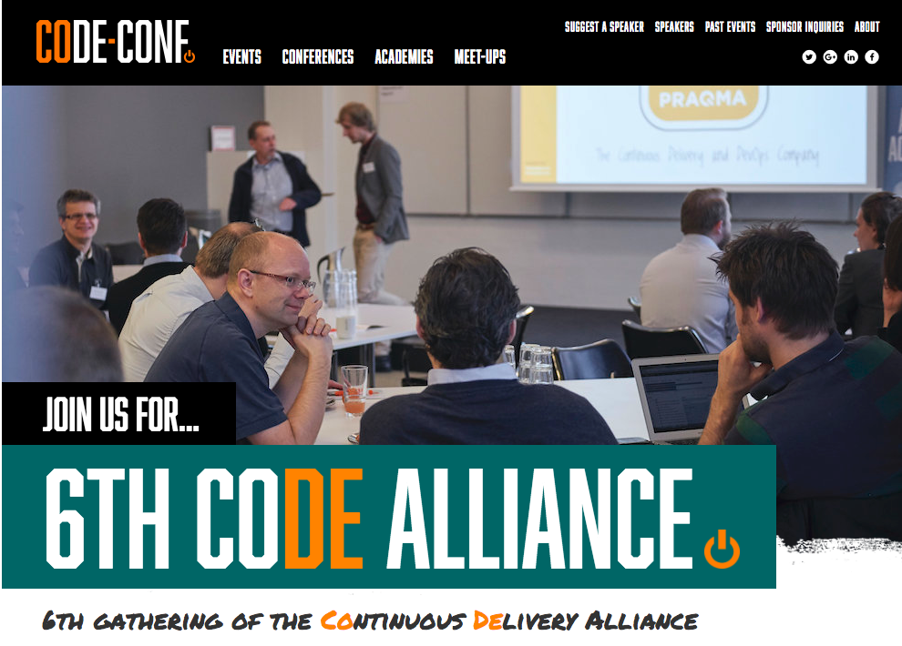
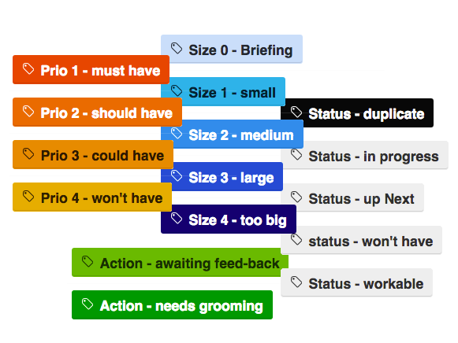
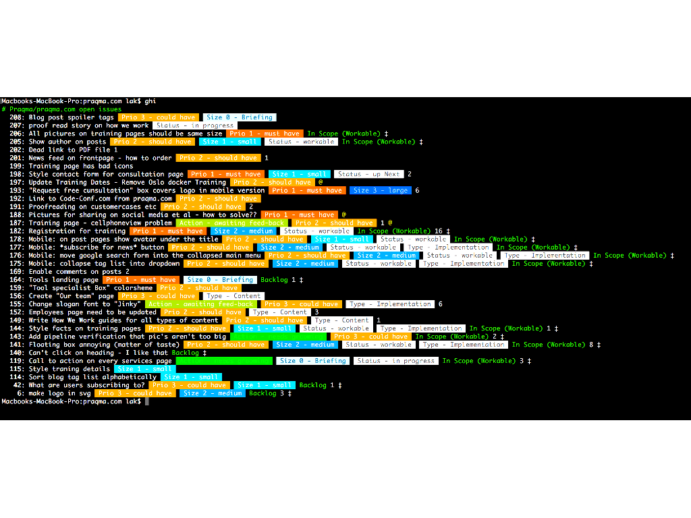
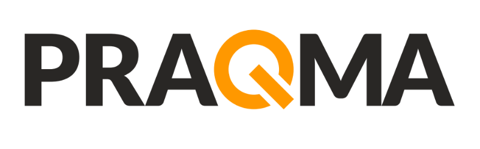
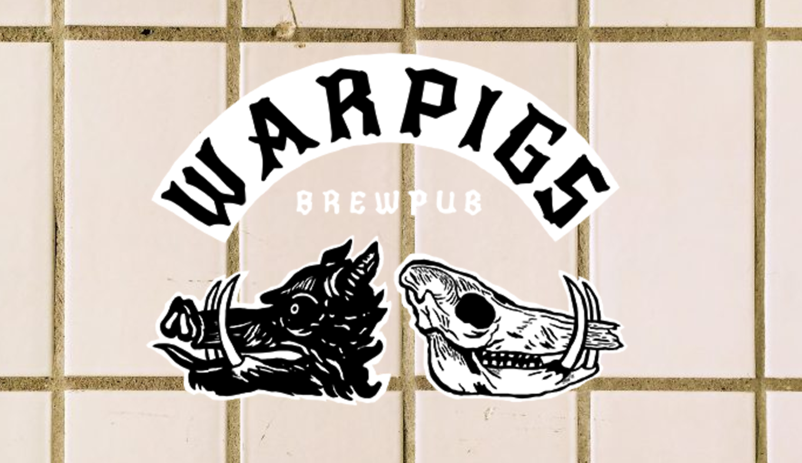

<!--

 To include this markdown in your reveal add the following section:

  <section data-markdown="name-of-your-markdown.md"
    data-separator="^>>>>NEWSECTION$"
    data-separator-vertical="^>>>>NEWSLIDE$"
    data-separator-notes="^Note:$">
  </section>

-->

## The Continuous Delivery Alliance

<!-- .element: class="plain  medium" -->

The alliance formerly known as JOSRA

...and it _is_ still about **Joint Open Source Roadmapping**

### 6th gathering

[code.praqma.com/alliance/6th-gathering](http://code.praqma.com/alliance/6th-gathering)

>>>>NEWSLIDE

### The Continuous Delivery pipeline

<!-- .element: class="plain max" -->

You all still remember why we're here - right?  ...to optimize the factory floor!

>>>>NEWSLIDE

## Program

[<!-- .element class="plain max"-->](http://www.code-conf.com/code-alliance-sixth/)<!-- .element target="_blank" -->

>>>>NEWSLIDE

### Praqma
Jasmine 
Andrey 
Bosse 
Bue 
Claus 
Jan 
Johan 
Leif 
Lars 
Mike 
Mads 
Sofus 
Timea

<!-- .element: class="names left"  -->

  

  ### MAN D & T
  Carsten 
  Niels Khristian 
  Kenneth 
  Anders 
  &nbsp; 
  &nbsp;
  
<!-- .element: class="fragment names left"  -->

  

  ### Napatech
  Dennis 
  Rasmus 
  Jesper 
  &nbsp; 
  &nbsp; 
  &nbsp;
  
<!-- .element: class="fragment names left"  -->

  

  ### Kamstrup
  Dan 
  Maria 
  Bo 
  &nbsp; 
  &nbsp; 
  &nbsp;
  
<!-- .element: class="fragment names left"  -->

  

  ### Grundfos
  Flemming 
  Rasmus 
  &nbsp; 
  &nbsp; 
  &nbsp; 
  &nbsp;
  
<!-- .element: class="fragment names left"  -->

  

  ### Skat
  Jan 
  &nbsp; 
  &nbsp; 
  &nbsp; 
  &nbsp; 
  &nbsp;
  
<!-- .element: class="fragment names left"  -->

  

  ### Volvo
  Samuel 
  &nbsp; 
  &nbsp; 
  &nbsp;
  
<!-- .element: class="fragment names left"  -->

  

  ### Siemens WP
  Søren 
  &nbsp; 
  &nbsp; 
  &nbsp;
  
<!-- .element: class="fragment names left"  -->

  

  ### Gul og Gratis
  Brian 
  &nbsp; 
  &nbsp; 
  &nbsp;
  
<!-- .element: class="fragment names left"  -->

<!-- .element: style="width:100%" -->

Note:

In Praqma we strive to practice the _buy a man - get a team_ approach with every customer. Consequently, every customer should ideally know more Praqma employees than just the usual suspects that helps them on a daily basis.

The Code Alliance is a means for that - that's why we prioritize to send so many of our own people

>>>>NEWSECTION

## State of the Alliance

<!-- .element: class="plain  medium" -->

How we work! What’s new? What has changed?

[Slack](http://josra.slack.com)<!-- .element target="_blank" -->

[GitHub Repositories](https://github.com/Praqma?utf8=✓&q=&type=public)<!-- .element target="_blank" -->

>>>>NEWSLIDE

## How We Work

Get an idea <!--  .element class="fragment"  -->

Describe it <!-- .element class="fragment" -->

Evolve it <!-- .element class="fragment" -->

Distill it <!-- .element class="fragment" -->

Fund it <!-- .element class="fragment" -->

Create it <!-- .element class="fragment" -->

Deliver it <!-- .element class="fragment" -->

Note:

This approach is really simple - and it's a recap on the 5th gathering presentation.

The gatherings are really focusing on the first two bullets

Ideas come from multiple sources, but always for the same cause:

"Someone identified a genuine problem, that can be solved with software"

The first description of an idea is usually captured as an issue in a GitHub repository

Everyone has access to contribute to the GitHub repositories, and that is how it evolves.

>>>>NEWSLIDE

## How We Work

  [<!-- .element class="plain medium left" -->](http://www.praqma.com/stories/milestones-and-officehours/)<!-- .element target="_blank" -->

  [praqma.com/stories/milestones-and-officehours](http://www.praqma.com/stories/milestones-and-officehours/)<!-- .element target="_blank" -->

  [<!-- .element class="plain medium left" -->](http://www.praqma.com/stories/a-pragmatic-workflow/)<!-- .element target="_blank" -->

  [praqma.com/stories/a-pragmatic-workflow](http://www.praqma.com/stories/a-pragmatic-workflow/)<!-- .element target="_blank" -->

>>>>NEWSECTION

## State of the Alliance

<!-- .element: class="plain  medium" -->

Status on backlog, pipeline and roadmaps.

>>>>NEWSLIDE

## Progress since last

__The Phlow__ <!-- .element class="fragment" -->

__Pretested Integration Plugin__<!-- .element class="fragment" -->

__2git__<!-- .element class="fragment" -->

>>>>NEWSECTION

<!-- .element class="plain large" -->

**Organization and funding**

PraqmaPlex

Interns

Skattefunn
<!-- .element class="fragment twocol " -->

**New (added) focus**

**Ops**  _Infrastructure as Code_

**Test**  _Compliance as Code_   _visibility_ - _tracability_ - _execution_
<!-- .element class="fragment twocol " -->

>>>>NEWSECTION

## MAN Diesel & Turbo

>>>>NEWSECTION

## Workshops

>>>>NEWSECTION

## Wrap up

>>>>NEWSLIDE

[<!-- .element: class="plain  medium" -->](http://http://warpigs.dk/)<!-- .element target="_blank" -->

17:00 (dinner 17:45)

Flæsketorvet 25 – 37
