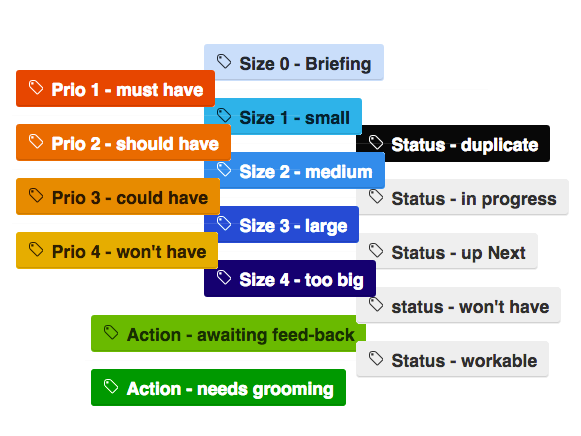
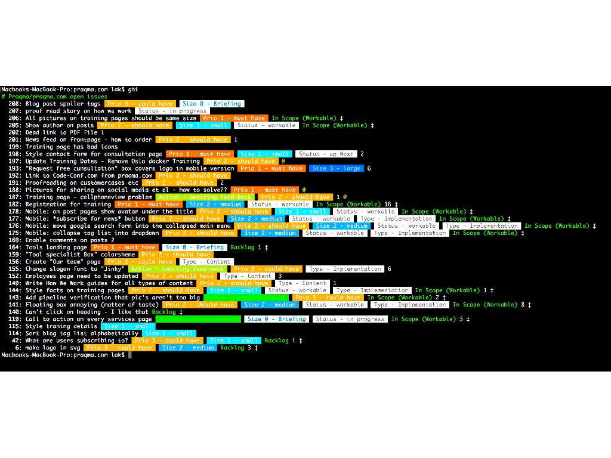
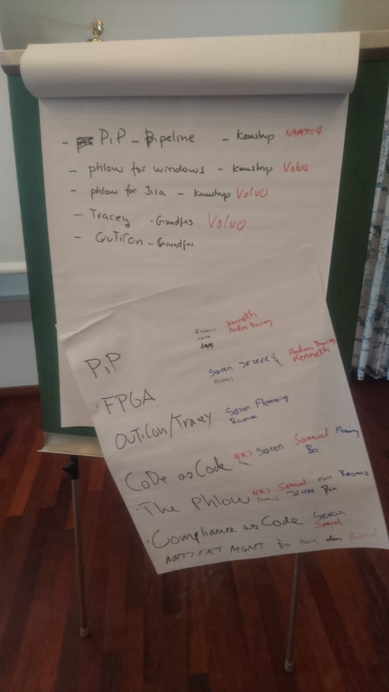

<!--

 To include this markdown in your reveal add the following section:

  <section data-markdown="name-of-your-markdown.md"
    data-separator="^>>>>NEWSECTION$"
    data-separator-vertical="^>>>>NEWSLIDE$"
    data-separator-notes="^Note:$">
  </section>

-->

## The Continuous Delivery Alliance

<!-- .element: class="plain  medium" -->

The alliance formerly known as JOSRA

...and it _is_ still about **Joint Open Source Roadmapping**

### 7th gathering

[http://alliance.praqma.com/gatherings](http://www.code-conf.com/code-alliance-seven/)

>>>>NEWSLIDE

### The Continuous Delivery pipeline

You all still remember why we're here - right?  ...to optimize the factory floor!

<!-- .element: class="plain max" -->

>>>>NEWSLIDE

## Program

**Traceability as a theme!**

Two days

* State of the Alliance, ligthening talks and demos, break out sessions
* Room for much more and traceability!

[<!-- .element class="plain max"-->](http://alliance.praqma.com/gatherings/)<!-- .element target="_blank" -->

_We will continuously improve and form the program. Speak up!_

>>>>NEWSECTION

## Collaboration in the Alliance

<!-- .element: class="plain  medium" -->

How we work! That's not new - right?

[http://josra.slack.com](http://josra.slack.com) - join! <!-- .element target="_blank" -->

[Public GitHub repositories using issues](https://github.com/Praqma?utf8=✓&q=&type=public)<!-- .element target="_blank" -->

[https://github.com/Praqma/git-phlow/issues](https://github.com/Praqma/git-phlow/issues)

>>>>NEWSLIDE

## How We Work

Get an idea <!--  .element class="fragment"  -->

Describe it <!-- .element class="fragment" -->

Evolve it <!-- .element class="fragment" -->

Distill it <!-- .element class="fragment" -->

Fund it <!-- .element class="fragment" -->

Create it <!-- .element class="fragment" -->

Deliver it <!-- .element class="fragment" -->

Note:

This approach is really simple - and it's a recap from last many gatherings.

The gatherings are really focusing on the first two bullets

Ideas come from multiple sources, but always for the same cause:

"Someone identified a genuine problem, that can be solved with software"

The first description of an idea is usually captured as an issue in a GitHub repository

Everyone has access to contribute to the GitHub repositories, and that is how it evolves.

>>>>NEWSLIDE

## How We Work

  [<!-- .element class="plain medium left" -->](http://www.praqma.com/stories/milestones-and-officehours/)<!-- .element target="_blank" -->

  [praqma.com/stories/milestones-and-officehours](http://www.praqma.com/stories/milestones-and-officehours/)<!-- .element target="_blank" -->

  [<!-- .element class="plain medium left" -->](http://www.praqma.com/stories/a-pragmatic-workflow/)<!-- .element target="_blank" -->

  [praqma.com/stories/a-pragmatic-workflow](http://www.praqma.com/stories/a-pragmatic-workflow/)<!-- .element target="_blank" -->

Note:

This is what our Git Phlow is also focussing around. We try to work this way in Praqma.

>>>>NEWSECTION

## State of the Alliance

<!-- .element: class="plain  medium" -->

Status on backlog, pipeline and roadmaps.

>>>>NEWSLIDE

<!-- .element: class="plain  medium" -->

>>>>NEWSLIDE

## Since last time

__The Git Phlow and Pretested Integration Plugin__ <!-- .element class="fragment" -->

__Jenkins Configuration as Code - a CloudBees blessed project__<!-- .element class="fragment" -->

__Coordinated traceability efforts__<!-- .element class="fragment" -->

__Managed DevOps offering Mission Control and Orbit__<!-- .element class="fragment" -->

__Upcoming new small tools like PlusBump, Emily's git viz tool__<!-- .element class="fragment" -->

__New alliance mini site [http://alliance.praqma.com](http://alliance.praqma.com)__<!-- .element class="fragment" -->

Note:

Respect and street creds to Kamstrup for funding our Git Phlow changes and the upcoming release of the Jenkins plugin.

Per Arnold from Microchip, formerly known as Atmel was the initial founding father, so one more time it actually achieved to build and stand of the shoulders of each others.

>>>>NEWSLIDE

<!-- .element class="plain large" -->

**Organization and funding**

PraqmaPlex

Interns

You!

<!-- .element class="fragment twocol " -->

**Focus areas**

**Ops**  _Infrastructure as Code_

**Traceability**  _Compliance as Code_   _visibility_ - _tracability_ - _execution_
<!-- .element class="fragment twocol " -->

>>>>NEWSLIDE

## The Alliance

### Praqma
Bue 
Lars 
Jan 
Johan 
Ewelina 
Mike 
Edmond 
Simon 
Emily 
Samuel

<!-- .element: class="names left"  -->

  

  ### Let it off your chest<!-- .element:  style="color:red;"-->
  What are your challenges? 
  What are you proud of? 
  Effort within Traceability? Needs? 
  Expectations to our gathering?
  
<!-- .element: class="fragment names left"  style="color:red;size:85%;"-->

  

  ### Volvo
  Samuel 
  Daniel 
  Rasmus 
  Karl-Johan 
  Peter 
  Johan 
  
<!-- .element: class="fragment names left"-->

  

  ### Kamstrup
  Dan 
  Maria 
  Bo 
  Emil 
  &nbsp; 
  &nbsp;
  
<!-- .element: class="fragment names left"  -->

  

  ### Grundfos
  Flemming 
  Rasmus 
  Gert 
  &nbsp; 
  &nbsp; 
  &nbsp;
  
<!-- .element: class="fragment names left"  -->

  

  ### Napatech
  Dennis 
  Rasmus 
  &nbsp; 
  &nbsp; 
  &nbsp;
  
<!-- .element: class="fragment names left"  -->

  

  ### Vestas
  Brian 
  Rolf 
  &nbsp; 
  &nbsp; 
  &nbsp; 
  &nbsp;
  
<!-- .element: class="fragment names left"  -->

  

  ### Siemens WP
  Søren 
  Tijana 
  &nbsp; 
  &nbsp;
  
<!-- .element: class="fragment names left"  -->

  

  ### Microchip
  Per Arnold 
  &nbsp; 
  &nbsp; 
  &nbsp;
  
<!-- .element: class="fragment names left"  -->

<!-- .element: style="width:100%" -->

Note:

In Praqma we strive to practice the _buy a man - get a team_ approach with every customer. Consequently, every customer should ideally know more Praqma employees than just the usual suspects that helps them on a daily basis.
So today we're quite many, and you have the change to talk to us and meet us in presentations, workshops etc.

>>>>NEWSECTION

## Volvo

>>>>NEWSLIDE

## Talks

**Git Phlow - daily life now with Jira, Windows and Jenkins pipeline** (_Bue and Simon_)

**Jenkins as Code - A flexible MVP** (_Ewelina_)

**All the traceability projects** (_Bue_)

(and more ... PlusBump, Measuring CI, Custom Bill of Materials - Gradle plugin, Orbit - Managed Ops, ASK - Atlassian Software in Kubernetes, Questionnaire)

Note:

We see it more like an un-conference, so beside the 3 above Code Alliance progress talks, we have lots of other ready ... and this is also now the time where you can suggest yours!

What do you want? Speak up.

>>>>NEWSECTION

## Workshops

Capture action Points

Constitute working groups

Roadmapping

>>>>NEWSECTION

<!-- .element target="_blank" -->

18:00 (dinner 19:00)

