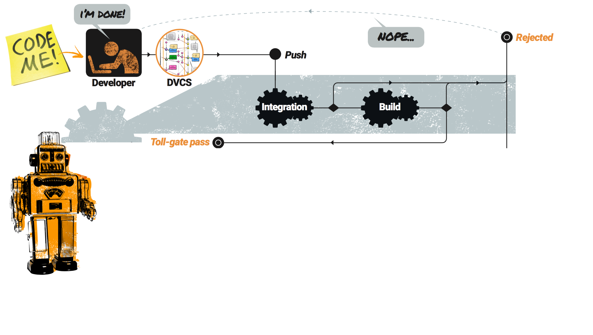
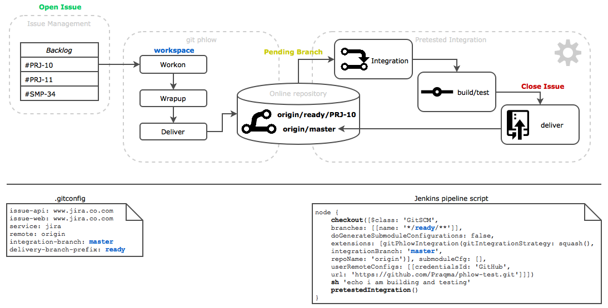
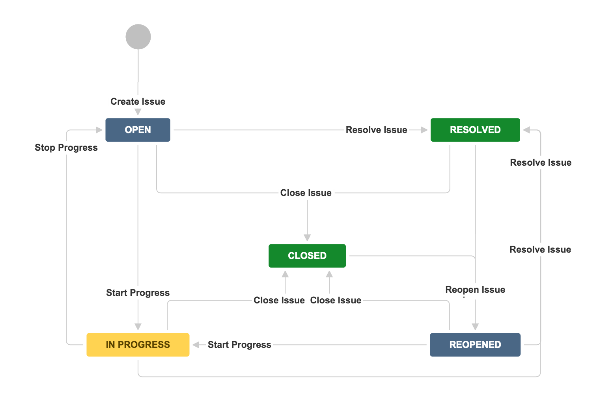

# The Phlow

**Brought to you by Kamstrup**.

* The Git extension
* Jenkins Pretested Integration Plugin

_Changes, status and roadmap suggestion_.

>>>>NEWSLIDE

## Solution?

<!-- .element: class="plain max" -->

<!-- .slide: data-transition="slide-in none" -->
>>>>NEWSLIDE


<!-- .slide: data-transition="none slide-out" -->

## Solution?

<!-- .element: class="plain max" -->


>>>>NEWSLIDE

## What is the solution

Make it easy<br/><!-- .element class="fragment" -->

Tie tasks to commits<br/><!--  .element class="fragment"  -->

Release train<br/><!-- .element class="fragment" -->

Milestones and office hours<br/><!-- .element class="fragment" -->

Automate all the things<br/><!-- .element class="fragment" -->

Any CI (Jenkins, Travis, Concourse)<br/><!-- .element class="fragment" -->

>>>>NEWSLIDE


[<!-- .element class="plain max" -->](https://github.com/Praqma/praqma.com/commits/gh-pages?after=4c2b41b0ed7e8233bd0e8d097dfdca20e46c6f50+245)

>>>>NEWSECTION

## Changes

**Windows support**
  - git bash
  - cmd
  - powershell

**Jira**

(Github, Bitbucket, Gitlab)

Note:

Also still supports Github issues and Github repositories, basically any repo.


>>>>NEWSLIDE

## Installation

### Scoop + Chocolatey

```sh
choco install git-phlow
```

```sh
scoop bucket add praqma-tools https://github.com/praqma/scoop-praqma-tools.git
scoop install git-phlow
```

[Installation in https://github.com/Praqma/git-phlow#installing-git-phlow-tool](https://github.com/Praqma/git-phlow#installing-git-phlow-tool)

Note:

* It also still support Linux installing just the binary manually.

>>>>NEWSLIDE

## Pretested Integration Plugin

* Scripted and declarative pipeline support
* SCM Extension instead of a build wrapper

_Breaking change!_

Note:

* Moving from a build wrapper to git scm extension makes it more flexible to use with other job types, like matrix.


>>>>NEWSECTION

# Configuration
Configuration as Code

>>>>NEWSLIDE

### git phlow

Build on top of `git config`

Uses `.gitconfig`

**supports**

- workflow with forks <!-- .element class="fragment" -->
- workflow with multiple integration branches <!-- .element class="fragment" -->

<div>
```ini
[phlow]
remote                 = origin
service                = jira
integration-branch     = master
issue-api              = http://jira.company.com
issue-web              = http://jira.company.com
delivery-branch-prefix = ready
```
</div> <!-- .element class="fragment" -->


>>>>NEWSLIDE

### Pretested Integration Plugin
- configured through scripted pipeline
- Help from syntax generator

<div>
```groovy
node {
  checkout([$class: 'GitSCM', branches: [[name: '*/ready/**']],
  doGenerateSubmoduleConfigurations: false,
  extensions: [gitPhlowIntegration(gitIntegrationStrategy: squash(),
  integrationBranch: 'master', repoName: 'origin')], submoduleCfg: [],
  userRemoteConfigs: [[credentialsId: 'GitHub',
      url: 'https://github.com/Praqma/phlow-test.git']]])   
    sh 'mvn install'
  pretestedIntegration()
}
```
</div><!-- .element class="fragment" -->


>>>>NEWSLIDE

### Remember to enable smart commits

* Github have it default
* Install Jira Smart Commits and allow application links

https://marketplace.atlassian.com/plugins/com.lb.software.stash.smart.commit.lb-software-stash-smart-commit/


>>>>NEWSECTION

## Jira workflow limitations

<!-- .element: class="plain max" -->

>>>>NEWSLIDE

<!-- .element: class="plain medium" -->

* Transition name matters (must start with magic word)
* Status category matters (hidden)
* Limitations will give a warning

https://github.com/Praqma/git-phlow#compatability-matirix

Note:

* If we can transition issue, or assign you we give a warnings but don't block you from continue.
* We establish the git branch etc, and allows you to fix Jira yourself.
* Jira have to many limitations so it wouldn't make sense to block.
* Github works the same way... you're just never blocked by transitions because it is labels.


>>>>NEWSECTION

## Roadmap

- Project keys for Jira [GHI 251](https://github.com/Praqma/git-phlow/issues/251)
- Configuration of keywords (for Jira)
- Resume work on failed integration branch
- Park command
    - share a branch
    - work on a parked branch resume
- wrapup command
    - multi-line wrapup
    - plusBump

>>>>NEWSLIDE

## Sementic Commit Message

- **chore:** add Oyster build script
- **docs:** explain hat wobble
- **feat:** add beta sequence
- **fix:** remove broken confirmation message
- **refactor:** share logic between 4d3d3d3 and flarhgunnstow
- **style:** convert tabs to spaces
- **test:** ensure Tayne retains clothing

<div>
```sh
641a9e7 close #4 feat: multiple line selection in editor
```
</div><!-- .element class="fragment" -->


>>>>NEWSLIDE

## User modes

* Normal default mode or expert mode?
* Customized parameter defaults (cfg file)


Note:

Maybe introduce two kind of users, supporting them with two modes in the tool.

Customized parameter default could be to configure to alway run with a special parameter flag on of the commands.
