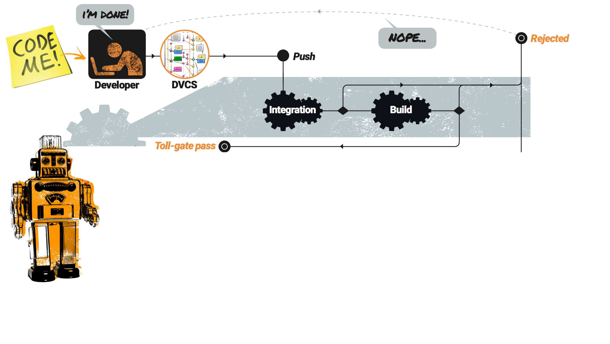

# The Phlow

>>>>NEWSLIDE

## Support
**Windows** <!-- .element class="fragment" -->
  - git bash <!-- .element class="fragment" -->
  - cmd <!-- .element class="fragment" -->
  - powershell <!-- .element class="fragment" -->

**Task management** <!-- .element class="fragment" -->
  - github issues <!-- .element class="fragment" -->
  - Jira <!-- .element class="fragment" -->

>>>>NEWSLIDE

## Installation

- Scoop, Chocolatey, homebrew
```sh
#
choco install git-phlow
#
```
```sh
brew tap praqma/praqma-tap
#
brew install git-phlow
```
```sh
scoop bucket add praqma-tools https://github.com/praqma/scoop-praqma-tools.git
#
scoop install git-phlow
```

>>>>NEWSECTION

# Configuration
Configuration as Code

>>>>NEWSLIDE

### git phlow

Build on top of `git config`

Uses `.gitconfig`

**supports**

- workflow with forks <!-- .element class="fragment" --> 
- workflow with multiple integration branches <!-- .element class="fragment" -->

<div>
```ini
[phlow]
remote                 = origin
service                = jira
integration-branch     = master
issue-api              = http://jira.company.com
issue-web              = http://jira.company.com
delivery-branch-prefix = ready
```
</div> <!-- .element class="fragment" -->


>>>>NEWSLIDE

### Pretested Integration
- configured through build script
- Help from syntax generator

<div>
```groovy
node {
  checkout([$class: 'GitSCM', branches: [[name: '*/ready/**']], 
  doGenerateSubmoduleConfigurations: false,
  extensions: [gitPhlowIntegration(gitIntegrationStrategy: squash(),
  integrationBranch: 'master', repoName: 'origin')], submoduleCfg: [], 
  userRemoteConfigs: [[credentialsId: 'GitHub', 
      url: 'https://github.com/Praqma/phlow-test.git']]])   
    sh 'mvn install'
  pretestedIntegration()
}
```
</div><!-- .element class="fragment" -->


>>>>NEWSLIDE

## Jira workflow

[<!-- .element class="plain max" -->](https://github.com/Praqma/praqma.com/commits/gh-pages?after=4c2b41b0ed7e8233bd0e8d097dfdca20e46c6f50+245)

@Buep

>>>>NEWSLIDE

### Nice!

[<!-- .element class="plain max" -->](https://github.com/Praqma/praqma.com/commits/gh-pages?after=4c2b41b0ed7e8233bd0e8d097dfdca20e46c6f50+245)<!-- .element target="_blank" -->

>>>>NEWSECTION


## Solution?

<!-- .element: class="plain max" -->

<!-- .slide: data-transition="slide-in none" -->

>>>>NEWSLIDE

<!-- .slide: data-transition="none slide-out" -->

## Solution?

<!-- .element: class="plain max" -->


>>>>NEWSLIDE

## What is the solution

Make it easy<br/><!-- .element class="fragment" -->

Tie tasks to commits<br/><!--  .element class="fragment"  -->

Release train<br/><!-- .element class="fragment" -->

Milestones and office hours<br/><!-- .element class="fragment" -->

Automate all the things<br/><!-- .element class="fragment" -->

Any CI (Jenkins, Travis, Concourse)<br/><!-- .element class="fragment" -->


>>>>NEWSECTION

## Roadmap

- Project key for Jira
- Resume work on failed integration branch
- Config keywords for Jira
- park command
    - share a branch on github
    - workon a shared branch
- wrapup command
    - semantic commits (feat: doc: fix: bug: ...)
    - multi-line wrapup

>>>>NEWSLIDE

## Sementic Commit Message 

- **chore:** add Oyster build script
- **docs:** explain hat wobble
- **feat:** add beta sequence
- **fix:** remove broken confirmation message
- **refactor:** share logic between 4d3d3d3 and flarhgunnstow
- **style:** convert tabs to spaces
- **test:** ensure Tayne retains clothing

<div>
```sh 
641a9e7 close #4 feat: multiple line selection in editor
```
</div><!-- .element class="fragment" -->