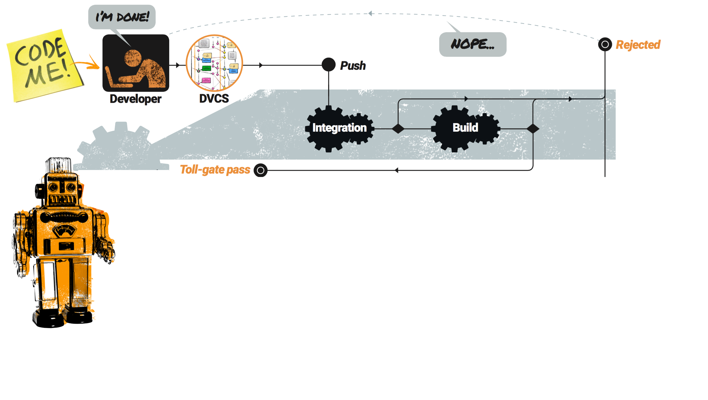

<!--

 To include this markdown in your reveal add the following section:

  <section data-markdown="name-of-your-markdown.md"
    data-separator="^>>>>NEWSECTION$"
    data-separator-vertical="^>>>>NEWSLIDE$"
    data-separator-notes="^Note:$">
  </section>

-->

# The Phlow

>>>>NEWSLIDE

## What is the problem

Keeping track of work coming in - and getting done <!-- .element class="fragment" -->

Too much friction in the systems <!-- .element class="fragment" -->

Branching strategies <!-- .element class="fragment" -->

Release strategies <!-- .element class="fragment" -->

>>>>NEWSLIDE

## As a software developer

**I want**  all features that support the process to be available from my IDE or my terminal

**So that**  I don't have to go to many different tools, to organize and manage my work flow

>>>>NEWSLIDE

## As a product owner

**I want**  every single commit to happen for a documented reason, and that reason should be tied to the the commit

**So that**  When I need an overview I can just browse the commit history

>>>>NEWSECTION
## Solution?

<!-- .element: class="plain max" -->

<!-- .slide: data-transition="slide-in none" -->

>>>>NEWSLIDE

<!-- .slide: data-transition="none slide-out" -->

## Solution?

<!-- .element: class="plain max" -->

>>>>NEWSLIDE

## What is the solution

Make it easy <!-- .element class="fragment" -->

Tie tasks to commits <!--  .element class="fragment"  -->

Release train <!-- .element class="fragment" -->

Milestones and office hours <!-- .element class="fragment" -->

Automate all the things <!-- .element class="fragment" -->

Any CI (Jenkins, Travis, Concourse) <!-- .element class="fragment" -->

>>>>NEWSECTION

## Community

Repo

Issues

Concourse

>>>>NEWSLIDE

## Demo (10 min)

Outline (Issues, repo, Waffle)

Demo 

>>>>NEWSLIDE

## Roadmap

- Code Café
- Community
- Features
    - Jira support
    - Windows
    - Apt-get installer
- More CI support
